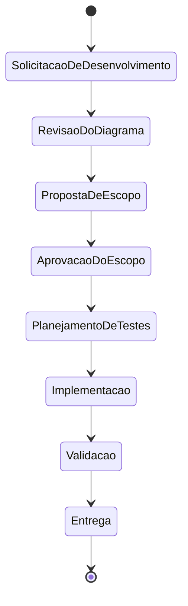
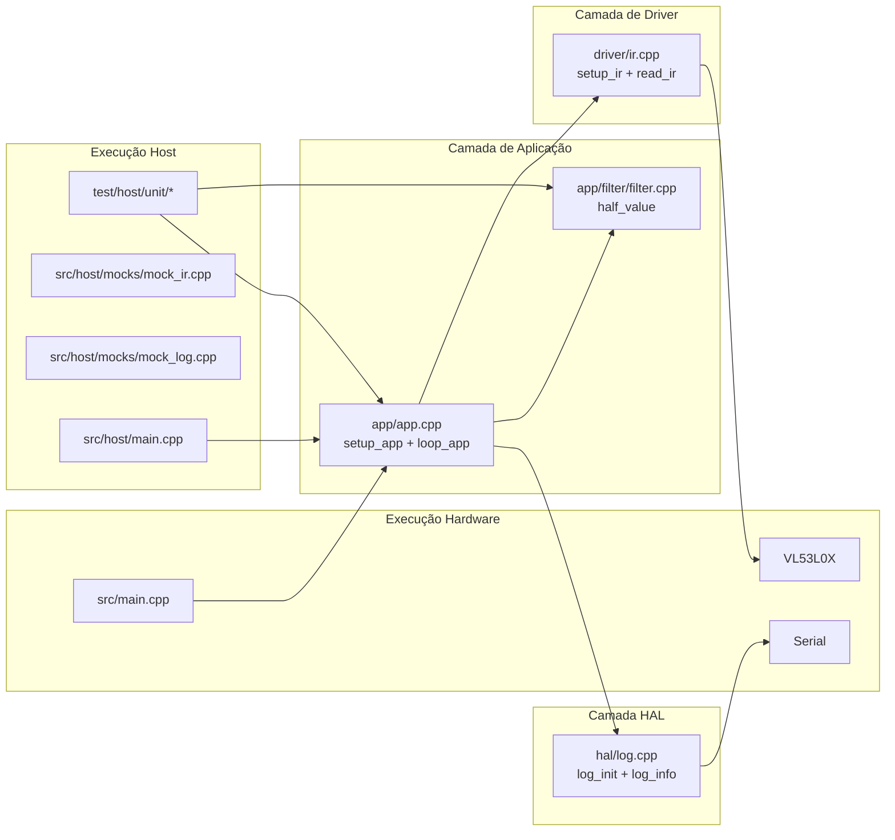

# DIAGRAM.md — Fluxo oficial e visão arquitetural do projeto

Este diagrama consolida:

1. **Fluxo oficial de execução** exigido pelo processo (estados 01..08 em `governance/`).
2. **Visão técnica atual** do firmware para host-based testing e hardware alvo.

## 1) Fluxo oficial de execução (governança)

## 2) Arquitetura lógica atual (código existente)

## 3) Regras arquiteturais

- Regras de negócio ficam na camada `app/` e devem ser testáveis em host.
- Dependências de hardware ficam isoladas em `driver/` e `hal/`.
- Mocks de host devem manter o mesmo contrato público dos módulos reais.
- Mudanças estruturais de processo devem atualizar este documento antes dos demais.

## 4) Mapeamento obrigatório de documentos

- Fluxo formal de estados: `governance/01-SolicitacaoDeDesenvolvimento.md` até `governance/08-Entrega.md`.
- Baseline técnica do código atual: `architecture/TECHNICAL_BASELINE.md`.
- Pinagem de firmware: `FIRMWARE_GPIO_MAP.md`.
