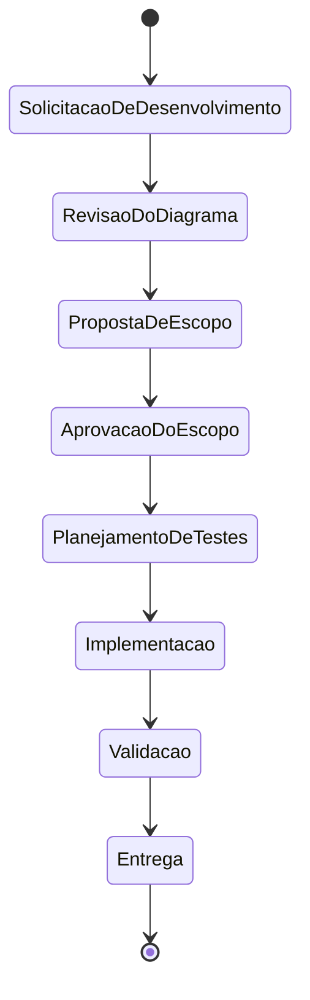
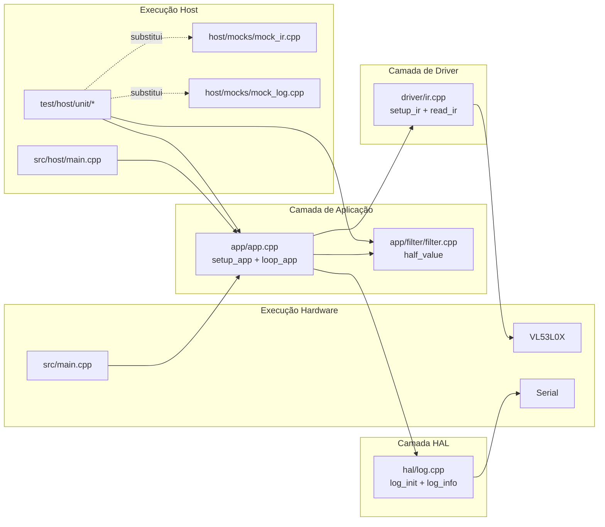

# DIAGRAM.md — Fluxo de Engenharia + Arquitetura Lógica

Este documento foi atualizado para refletir o estado **real** do repositório
(implementação já existente antes da adoção do agente), mantendo o fluxo de
estados exigido e adicionando a visão técnica de execução em **host** e em
**hardware alvo**.

## 1) Fluxo de estados (governança de execução)

## 2) Arquitetura lógica do firmware (estado atual)

## 3) Regras arquiteturais derivadas

- A camada `app/` concentra regra de negócio e deve permanecer testável em host.
- Dependências de hardware ficam isoladas em `driver/` e `hal/`.
- Mocks em `src/host/mocks/` devem manter a mesma interface pública das
  dependências reais para viabilizar testes determinísticos.
- Qualquer mudança estrutural de fluxo ou camadas deve ser refletida primeiro
  neste arquivo.

## 4) Mapeamento para artefatos técnicos

- Fluxo de estados formal: `governance/01..08-*.md`.
- Detalhamento técnico complementar: `architecture/TECHNICAL_BASELINE.md`.
- Pinagem e observações de GPIO: `FIRMWARE_GPIO_MAP.md`.
