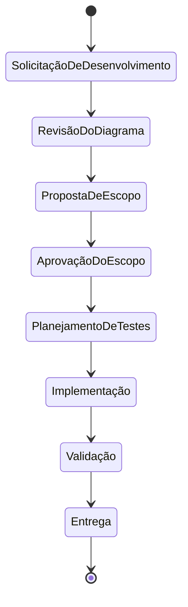

# DIAGRAM.md — Diagrama de Espaço de Estados (Alto Nível)

## Mapeamento para detalhamento arquitetural

- SolicitaçãoDeDesenvolvimento: `architecture/01-SolicitacaoDeDesenvolvimento.md`
- RevisãoDoDiagrama: `architecture/02-RevisaoDoDiagrama.md`
- PropostaDeEscopo: `architecture/03-PropostaDeEscopo.md`
- AprovaçãoDoEscopo: `architecture/04-AprovacaoDoEscopo.md`
- PlanejamentoDeTestes: `architecture/05-PlanejamentoDeTestes.md`
- Implementação: `architecture/06-Implementacao.md`
- Validação: `architecture/07-Validacao.md`
- Entrega: `architecture/08-Entrega.md`

## Observações

- Se `architecture/DIAGRAM.md` não existir no início de uma solicitação, ele deve ser criado.
- À medida que o projeto evoluir, criar/atualizar os arquivos `.md` de cada estado em `architecture/`.
- Mudanças estruturais no processo devem refletir primeiro neste diagrama.
- As aprovações formais do fluxo seguem os arquivos em `governance/`.
